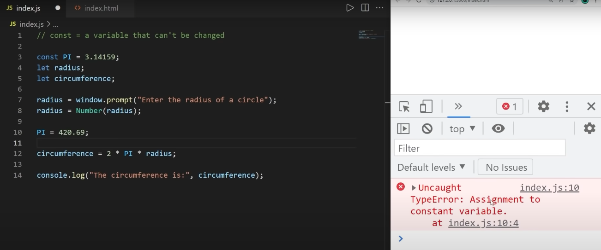
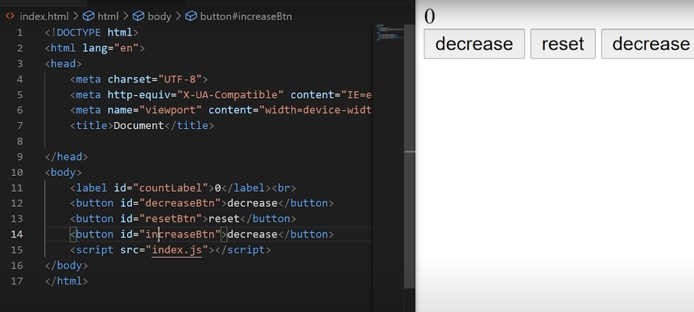

# JavaScript_full_lessions-2023-
This repo is to learn JavaScript completely.


# Lesson 1
## What is JavaScript (JS) ?
A) It is a web based programming language. We can make  interactive weppages.
* Can build web and mobile apps
* create command tools
* Develop games
 
 ###### Knowinf HTML and CSS is helpful not it is not necessary that you must know it before learning JavaScript
 
**Things we need to Start our JavaScript jurney**
<p float="left">


</p>
vs code and chrome


## The Connection of coding language and Frameworks


## Creating 1'st Executable file  
* In vs code we shall start by making files with this extension index.html, index.js, style.css
* HTML will be our main landing page.
* css is for styling elements


## HTML file

## JS file

## css is empty (we have not created for giving it styling)

# Variables
Variable is a container where we can store any data
##


## How to declace a variable?
* we have a put this keyword let to decale a variable after let we shall add a name for our variable like age later we shall assign a data to the variable like 23 and with console log we can print that data in inspect column
##


## 
We were able to create variable in js file now let us make it a viewable content on the main screen on html page (connecting html and js file)
##
Go to index.html and follow as shown

##
Go to index.js and follow as shown and see the output

##
Lets make 
# Arithmatic Expressions and re-Declaring Variables


## How to make rounding off of a number (Math expressions)

## Some more Mathematical expressions


## User Input with a button
* Silly method using js 


* Proper method using HTML

* In second method code you can see we have declared id which will help us connecting the files js and html (Code in Js)
* 

## Data type
* Now we have been declaring variable and assigining data to it. to know what type of data we have to type simple line in code ```console.log(age)``` Then the output will be ```Number```


## Type Conversion
* We can chage DataType to ther format like ```Char``` to ```number```


# Variable (const)
* As the name only tells cannot change. ```let``` is a type of variable where we are able to change its type later in code to avoid that we shall make it const


# Making something interactive from what we have learnt till now
* We will make 3 buttons and will give styling this time and each buttons will have a particular action to be performed

* HTML code
* 

* CSS code 
* 

* JS code 
* 
* That was out functional project

## Properties of string
*  CSS code 
* 
* Some more commands on string
* * CSS code 
* 

## Slicing 
* Used for getting exact required data from string
* 
## Method Chaining
* method chaining = calling one method after another in one continuous line of code

* Old method 
* 

* Chaining method
* 

# If Statement 
* a basic form of decision-making if a condition is true, then do something if not, then don't do it! 
* Example
* 

# Switch 
* statement that examines a value for a match against many case clauses. More efficient that many "else if" statements
* 

# VAR variable
* It is better than let for sending data outside {}.
* if you are using let as variable 
* 
* using var you can do this
* 

# Array
* Think of it as a variable that can store multiple values
* 
* Sorting of a array is to make elements display in order like alphabetic wise ```let fruits = ["banana","apple","orange","mango"];```
```fruits = fruits.sort(); //inorder```
```fruits = fruits.sort().reverse(); //in reverse order```
```for (let fruit of fruits){```
```     console.log(fruit);```
```     }```
